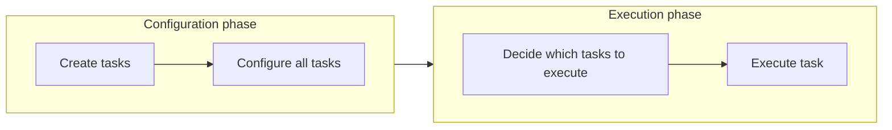
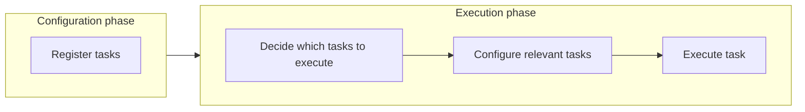
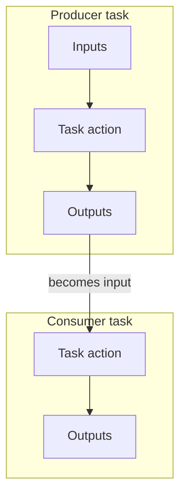

# Understanding the gradle fundamentals

- **Task**: "Actions" 🏃‍♂️
- **Plugin**: "Add Tasks to Project" 🔌

## Lifecycle

Gradle로 gradle build 같은 명령을 실행하면 대략 이런 순서로 돌아갑니다.

1. Initialization Phase (초기화 단계)
2. Configuration Phase (설정 단계)
3. Execution Phase (실행 단계)

## Defining Tasks

### Common Task Properties

1. group & description
2. doFirst & doLast
3. enabled (만약 `false`이면 `> Task :taskName SKIPPED` 표시됨.)
4. onlyIf (조건에 따라 task 실행 여부 결정, `> Task :taskName SKIPPED` 표시됨.)
5. dependsOn

## Locating Tasks

**기존**



- `Configure all tasks` 단계에서 모든 task가 메모리에 올라가고 설정이 완료됩니다. (Expensive)

**개선된 방식**



### 요약

`TaskProvider<T>` API를 사용하여 task를 등록하고 참조하는 것이 좋습니다. 이렇게 하면 Gradle이 필요한 task만 메모리에 올리고 설정할 수 있어 빌드 성능이 향상됩니다.

`Task`의 생성은 configuration 단계 혹은 execution 단계에서 지연될 수 있습니다.

```kotlin
// ✅ 권장: Lazy Configuration
tasks.register<Copy>("copyFiles") {
    from("srcDir")
    into("destDir")
}

// ❌ 비권장: Eager Configuration
tasks.create<Copy>("copyFiles") {
    from("srcDir")
    into("destDir")
}

// ✅ 권장: Task Configuration Avoidance API 사용
// TaskProvider<T> named(String name)
task.named<Copy>("copyFiles") {
    // 설정 변경
    into("newDestDir")
}

// ❌ 비권장: 직접 Task 참조
// T getByName(String name)
task.getByName<Copy>("copyFiles") {
    // 설정 변경
    into("newDestDir")

}
```

## Task Dependencies and Ordering

| 옵션                 | 정의                                                       | 예시 (`A`, `B`)         | 동작 방식                                    | 순서 보장 강도      | 실제 실행 순서                         |
|--------------------|----------------------------------------------------------|-----------------------|------------------------------------------|---------------|----------------------------------|
| **dependsOn**      | A는 B에 **의존**하며, A 실행 전 반드시 B가 실행되어야 함                    | `A.dependsOn(B)`      | - A 실행 시 자동으로 B 실행<br>- 강력한 실행 의존성       | ⭐⭐⭐⭐⭐ (가장 강함) | **B → A**                        |
| **mustRunAfter**   | A가 실행된다면 **항상** B 이후에 실행되어야 함<br>(하지만 B를 자동 실행하지는 않음)    | `A.mustRunAfter(B)`   | - 두 태스크가 함께 실행될 때만 순서 강제<br>- 의존성은 아님    | ⭐⭐⭐⭐☆         | (둘 다 실행 시) **B → A**             |
| **shouldRunAfter** | A는 B **이후에 실행되는 것이 바람직함**, 하지만 필요하면 Gradle이 순서를 바꿀 수도 있음 | `A.shouldRunAfter(B)` | - 약한 순서 제약<br>- 충돌, 순환 등 상황에 따라 무시될 수 있음 | ⭐⭐☆☆☆         | (가능하면) **B → A**, 하지만 상황에 따라 달라짐 |
| **finalizedBy**    | A가 실행되면 **항상 B가 뒤따라 실행됨**                                | `A.finalizedBy(B)`    | - Cleanup 용도로 자주 사용<br>- A가 실패해도 B는 실행됨  | ⭐⭐⭐⭐⭐ (보장됨)   | **A → B**                        |

---

## 📌 핵심 차이 요약

| 옵션                 | 의존성 생성? | 순서만 제어?      | A 실행 시 B도 실행됨?   | B 실행 없이 A 가능? |
|--------------------|---------|--------------|------------------|---------------|
| **dependsOn**      | ✔       | ✖            | ✔                | ✖             |
| **mustRunAfter**   | ✖       | ✔ (강함)       | ✖                | ✔             |
| **shouldRunAfter** | ✖       | ✔ (약함)       | ✖                | ✔             |
| **finalizedBy**    | ✖       | ✔ (A → B 보장) | ✔ (A 실행 시 자동 실행) | ✖             |

---

## 📌 A와 B로 보는 간단 정리

| 옵션                      | 의미 (A 기준)                      | 실행 흐름                       |
|-------------------------|--------------------------------|-----------------------------|
| **A.dependsOn(B)**      | *“A 하기 전에 B 먼저 해야 한다.”*        | **B → A**                   |
| **A.mustRunAfter(B)**   | *“둘 다 실행된다면 반드시 B 다음에 A를 해라.”* | **B → A** (조건부)             |
| **A.shouldRunAfter(B)** | *“가능하면 B 다음에 A가 좋겠다.”*         | 대체로 **B → A**, (필요하면 무시 가능) |
| **A.finalizedBy(B)**    | *“A 끝나면 항상 B도 실행해라.”*          | **A → B**                   |

---

## 📌 예시 코드 (Kotlin DSL)

```kotlin
tasks.register("A")
tasks.register("B")

// 강한 의존성 (B → A)
tasks.named("A") {
    dependsOn("B")
}

// 강한 순서 제약 (둘 다 있을 때 B → A)
tasks.named("A") {
    mustRunAfter("B")
}

// 약한 순서 제약 (가능하면 B → A)
tasks.named("A") {
    shouldRunAfter("B")
}

// A 뒤에 항상 B 수행 (A → B)
tasks.named("A") {
    finalizedBy("B")
}
```

## Task inputs and outputs

Task는 입력과 출력을 가진 함수이다. 이러한 특성을 활용하면 `incremental build`와 `up-to-date checks`를 통해 빌드 성능을 향상시킬 수 있다.



### 예시

```kotlin
tasks.register<Copy>("copyFiles") {
    from("srcDir") // 입력
    into("destDir") // 출력
}

tasks.register<Zip>("zipFiles") {
    from(tasks.named<Copy>("copyFiles").flatMap { it.outputs }) // copyFiles의 출력이 zipFiles의 입력이 됨
    destinationDirectory.set(file("zipped"))
    archiveFileName.set("files.zip")
}
```

## Repositories and Dependencies

Maven에서 어떤 라이브러리를 의존성으로 추가하면,  
그 라이브러리가 또 다른 라이브러리들을 의존하고 있을 수 있다.

```text
내 프로젝트
 └── A 라이브러리
       └── B 라이브러리
             └── C 라이브러리
```

- `A`만 추가해도 B와 C도 자동으로 프로젝트에 추가되는 것 -> transitive dependency

### pom.xml artifact를 배포할 때 "transitive dependencies" 정보는 어떠한 역할을 할까?

Maven 중앙 저장소 등에 artifact를 업로드할 때는 보통:

- `my-library-1.0.0.jar` (실제 코드)
- `my-library-1.0.0.pom` (메타데이터)

이 두 가지를 배포한다.

여기서 .pom 파일 안에는 다음 정보가 포함된다:

- 이 Artifact가 어떤 의존성을 가진다?
- 그 의존성들의 scope은 무엇인가?
- 버전은 어떤가?

즉, “이 artifact가 가진 딜리버리 의존성 목록” 이를 통해 Maven은 트랜지티브 의존성을 자동으로 해결할 수 있다.


```kotlin
// settings.gradle.kts
dependencyResolutionManagement {
    repositories {
        mavenCentral()
        mavenLocal()
    }
}

pluginManagement {
    repositories {
        gradlePluginPortal()
        mavenCentral()
        mavenLocal()
    }
}
```
