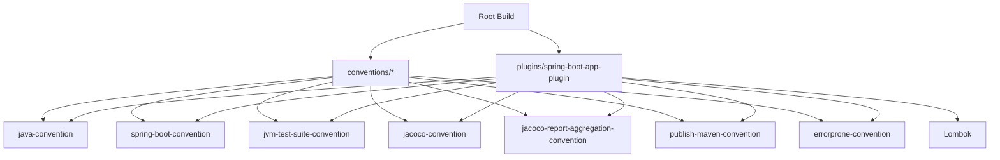

# gradle-plugins 프로젝트 평가

## 아키텍처 개요

- 멀티프로젝트로 분리된 컨벤션 플러그인(`conventions/*`)과 이를 한 번에 적용하는 Spring Boot 애플리케이션 플러그인(`plugins/spring-boot-app-plugin`) 구조.
- 루트 `build.gradle.kts`는 JDK 툴체인, Spotless, JUnit, Gradle TestKit, Jacoco 집계, Maven 퍼블리시 기본값을 강제해 모든 서브프로젝트가 동일한 품질선을
  갖도록 함.

## 강점

- **기본값**: `io.github.jongminchung.spring-boot-app` 하나로 Lombok, Error Prone/NullAway, Jacoco, Maven Publish 등
  서비스 개발에 필요한 기본 세팅을 모두 적용.
- **확장 포인트**: `ExtraJavaExtension`·`ExtraJacocoExtension`처럼 기본 동작을 켜고 끌 수 있는 토글을 제공해 팀 상황에 따라 조정 가능.
- **품질 도구 내장**: Error Prone/NullAway, JUnit Jupiter 기반 테스트 전환, Jacoco 리포트 집계 설정이 기본 포함.
- **예제 프로젝트 제공**: `examples/spring-boot-app-example`로 `mavenLocal`에 배포 후 실제 적용 방법을 실험 가능.

## 개선 제안

1. **Spring Boot 플러그인 확장 노출**  
   `SpringBootApplicationPlugin`이 모든 컨벤션을 무조건 적용하여 Lombok/NullAway/Jacoco 등 비선호 도구를 비활성화할 수 없음. `SpringBootAppExtension`
   을 추가해 `lombokEnabled`, `jacocoAggregation`, `publishEnabled` 같은 토글을 제공하면 팀별 도구 스택에 맞춰 선택 적용 가능.

2. **`bootBuildInfo` 타입 안전화 및 테스트 추가**  
   현재 `SpringBootConventionPlugin`은 리플렉션으로 `SpringBootExtension`에 접근. `spring-boot-gradle-plugin`이 이미 의존성에 있으므로 공개 API를
   직접 사용해 `bootBuildInfo`를 생성하고, `compileJava` 의존/순서 보장을 Functional Test로 검증하는 편이 안전.

3. **기존 확장 DSL 문서화**  
   `javaExt`, `jacocoExt` 토글이 사용자 문서에 언급되지 않아 IDE 자동완성도 기대하기 어려움. README와 docs에 사용 예시(
   `javaExt { withJavadocJar.set(false) }` 등)를 추가해 가시성을 높이고, 필요 시 프리컴파일드 스크립트 플러그인으로 Kotlin DSL 접근성을 강화.

4. **테스트 수트 실행 정책 명확화**  
   `JvmTestSuiteConventionPlugin`이 `functionalTest`/`integrationTest`/`performanceTest`를 모두 등록하지만 `check`에는
   `functionalTest`만 연결됨. 나머지를 실행할지, 옵션으로 둘지 결정해 문서와 빌드 스크립트에 반영하지 않으면 구성 시간만 늘고 혼란을 줄 수 있음.

5. **Jacoco 집계 사용성 개선**  
   집계 플러그인이 평가 완료 후 적용 대상 서브프로젝트를 추가하도록 구현되어 있음. 루트에서만 집계하도록 명시하거나, README에 `./gradlew testCodeCoverageReport` 실행법과 결과
   위치를 안내해 활용도를 높일 것.

## 다음 단계 제안

- Spring Boot 플러그인용 확장을 설계하고 각 컨벤션 적용 여부를 토글할 수 있게 리팩터링.
- `bootBuildInfo`를 타입 안전하게 구성하고 Gradle TestKit 기반 Functional Test로 회귀 검증 추가.
- README/docs에 기존 확장 토글 사용법을 추가하고, 추가 테스트 수트 실행 정책을 결정해 빌드·문서 양쪽에 반영.
- Jacoco 집계 동작 범위를 명확히 하고 실행 가이드를 문서화.
